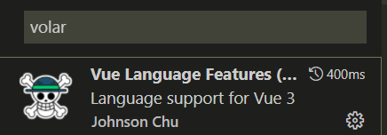

## 1.0 vue3 介绍

### 1.1 为什么要学习 vue 3


为什么要学 vue3:

1. Vue 是国内最火的前端框架
2. Vue 3 于 2022 年 2 月 7 日星期一成为新的默认版本！
   - 原文链接：https://blog.vuejs.org/posts/vue-3-as-the-new-default.html
   - 中文链接：https://zhuanlan.zhihu.com/p/460055155
3. Vue3 性能更高，体积更小
4. Vue3.0 在经过一年的迭代后，越来越好用

官方文档：

- vue3 官方文档：https://vuejs.org/
- vue3 中文文档：https://v3.cn.vuejs.org/

目前已支持 vue3 的 UI 组件库:

- **element-plus**

  https://element-plus.gitee.io/#/zh-CN (PC 组件库)

  Element Plus，一套为开发者、设计师和产品经理准备的基于 Vue 3.0 的桌面端组件库。

- **vant**

  https://vant-contrib.gitee.io/vant/v3/#/zh-CN

  轻量、可靠的移动端 Vue 组件库。

  Vant 是有赞前端团队开源的移动端组件库，于 2016 年开源，已持续维护 4 年时间。

  目前 Vant 已完成了对 Vue 3.0 的适配工作，并发布了 Vant 3.0 版本

* **ant-design-vue** (PC 组件库)

  https://antdv.com/./docs/vue/introduce-cn/

  ant-design-vue 是 Ant Design 的 Vue 实现，组件的风格与 Ant Design 保持同步

### 1.2 Vue3 动机 和 新特性

Vue3 设计理念 https://vue3js.cn/vue-composition/

动机与目的:

1. 更好的逻辑复用 与 代码组织 (composition 组合式 api)

   optionsAPI(旧) => compositionAPI（新）, 效果: 代码组织更方便了, 逻辑复用更方便了 非常利于维护!!

2. 更好的类型推导 (typescript 支持)

   vue3 源码用 ts 重写了, vue3 对 ts 的支持更友好了 (ts 可以让代码更加稳定, 类型检测! )

vue3 新特性：

1. 数据响应式原理重新实现 (ES6 proxy 替代了 ES5 的 Object.defineProperty)

   解决了: 例如数组的更新检测等 bug, 大大优化了响应式监听的性能

   (原来检测对象属性的变化, 需要一个个对属性递归监听) **proxy 可以直接对整个对象劫持**

2. 虚拟 DOM - 新算法 (更快 更小)

3. **提供了 composition api, 可以更好的逻辑复用**

4. 模板可以有多个根元素

5. 源码用 typescript 重写, 有更好的类型推导 (类型检测更为严格, 更稳定)

**小结： vue3 性能更高, 体积更小, 更利于复用, 代码维护更方便**

## 2.0 Vite 的使用


### 2.1 vite 介绍

> Vite 官方文档：https://cn.vitejs.dev/

Vite（法语意为 "快速的"，发音 `/vit/`，发音同 "veet")是一种新型前端构建工具

**优势**

- 💡 极速的服务启动，使用原生 ESM 文件，无需打包
- ⚡️ 轻量快速的热重载，始终极快的模块热重载（HMR）
- 🛠️ 丰富的功能，对 TypeScript、JSX、CSS 等支持开箱即用
- 📦 等等

### 2.2 为什么选 Vite ？

**传统方式**

- 基于打包器的方式启动，必须优先抓取并构建你的整个应用，然后才能提供服务。
- 更新速度会随着应用体积增长而直线下降。


**vite 方式**

- Vite 以 [原生 ESM](https://gitee.com/link?target=https%3A%2F%2Fdeveloper.mozilla.org%2Fzh-CN%2Fdocs%2FWeb%2FJavaScript%2FGuide%2FModules) 方式提供源码。这实际上是让浏览器接管了打包程序的部分工作。
- Vite 只需要在浏览器请求源码时进行转换并按需提供源码。
- 根据情景动态导入代码，即只在当前屏幕上实际使用时才会被处理。


问题小结:

- Vite 是否需要先打包才能提供服务？
- 使用 webpack 能否创建 vue3 的项目？

### 2.3 Vite 的基本使用

> 目标：能够使用 vite 创建一个 vue3 的项目

（1）使用 vite 创建项目

```bash
npm create vite
# or
yarn create vite
```

（2）输入项目名字，默认为 vite-project


（3）选择创建的项目类型，选择 vue 即可


（4）选择创建的 vue 项目类型， 不选 ts


（5）启动项目


**vite 快捷使用**

如果想要快速创建一个 vue3 项目，可以使用如下命令

- 创建普通 vue 项目

```bash
yarn create vite vite-demo --template vue
```

- 创建基于 ts 模板的项目

```bash
yarn create vite vite-demo-ts --template vue-ts
```

### 2.4 Vue3.0 项目介绍

> 任务目标：掌握 vue3 的项目目录结构

- 目录介绍

```js
|-- .gitignore
|-- README.md  			项目介绍
|-- index.html 			项目html页面
|-- package.json 		记录包
|-- vite.config.js 	关闭vite的配置文件
|-- yarn.lock
|-- public 					静态资源文件，不会进行编译
|   |-- favicon.ico
|-- src 						开发目录
|   |-- mian.js.    入口文件
```

- 删除 src 下所有的文件和代码
- 创建 main.js 入口文件

```js
console.log('hello vue3')
```

- createApp: 该函数可以接收一个根组件对象,返回一个提供应用上下文的应用实例(该实例用于渲染到该应用上)

```js
import { createApp } from 'vue'
import App from './App.vue'
createApp(App)
```

- mount，将应用根组件渲染到哪里，最终会通过 innerHtml 进行替换

```js
import { createApp } from 'vue'
import App from './App.vue'
const app = createApp(App)
app.mount('#app')
```

### 2.5 vscode 插件说明

- vue2 中需要安装插件`vetur`，可以实现组件高亮。但是 vue3 的一些语法在 vetur 中报错。
- vue3 中需要安装插件`volar`，提供了更加强大的功能。
- 所以，使用功能 vue3，需要卸载`vetur`插件，安装`volar`插件。



## 3.0 组合式 API

### 3.1 composition API vs options API

1. vue2 采用的就是 `optionsAPI`

   (1) 优点:**`易于学习和使用`**, 每个代码有着明确的位置 (例如: 数据放 data 中, 方法放 methods 中)

   (2) 缺点: 相似的逻辑, 不容易复用, 在大项目中尤为明显

   (3) 虽然 optionsAPI 可以通过 mixins 提取相同的逻辑, 但是也并不是特别好维护

2. vue3 新增的就是 `compositionAPI `

   (1) compositionAPI 是基于 **逻辑功能** 组织代码的, 一个功能 api 相关放到一起

   (2) 即使项目大了, 功能多了, 也能快速定位功能相关的 api

   (3) 大大的提升了 `代码可读性` 和 `可维护性`

3. vue3 推荐使用 composition API, 也保留了 options API

   即就算不用 composition API, 用 vue2 的写法也完全兼容!!

问题小结:` optionsAPI`的优缺点是什么? vue3 新增的 `compositionAPI ` 有什么特征? 有什么优势?

### 3.2 体验 composition API

**需求: 鼠标移动显示鼠标坐标 x, y**


options API 版本

```jsx
<template>
  <div>当前鼠标位置</div>
  <div>x: {{ mouse.x }}</div>
  <div>y: {{ mouse.y }}</div>
  <div>当前点击次数：{{ count }}</div>
  <button @click="add">点击</button>
</template>

<script>
export default {
  // vue2 中采用的是 options API
  // 常见的配置项: data created methods watch computed components
  data() {
    return {
      mouse: {
        x: 0,
        y: 0,
      },
      count: 0,
    }
  },
  mounted() {
    document.addEventListener('mousemove', this.move)
  },
  methods: {
    move(e) {
      this.mouse.x = e.pageX
      this.mouse.y = e.pageY
    },
    add() {
      this.count++
    },
  },
  destroyed() {
    document.removeEventListener('mousemove', this.move)
  },
}
</script>

```

composition API 版本

```vue
<template>
  <div>当前鼠标位置</div>
  <div>x: {{ mouse.x }}</div>
  <div>y: {{ mouse.y }}</div>
  <div>当前点击次数：{{ count }}</div>
  <button @click="add">点击</button>
</template>

<script>
import { onMounted, onUnmounted, reactive, ref } from 'vue'

export default {
  setup() {
    const count = ref(0)
    const add = () => {
      count.value++
    }

    const mouse = reactive({
      x: 0,
      y: 0
    })

    const move = e => {
      mouse.x = e.pageX
      mouse.y = e.pageY
    }
    onMounted(() => {
      document.addEventListener('mousemove', move)
    })
    onUnmounted(() => {
      document.removeEventListener('mousemove', move)
    })
    return {
      count,
      add,
      mouse
    }
  }
}
</script>
```

抽离逻辑

```jsx
function useMouse() {
  const mouse = reactive({
    x: 0,
    y: 0
  })
  const move = e => {
    mouse.x = e.pageX
    mouse.y = e.pageY
  }
  onMounted(() => {
    document.addEventListener('mousemove', move)
  })
  onUnmounted(() => {
    document.removeEventListener('mousemove', move)
  })
  return mouse
}

function useCount() {
  const count = ref(0)
  const add = () => {
    count.value++
  }
  return {
    count,
    add
  }
}
```

问题小结:` optionsAPI`的优缺点是什么? vue3 新增的 `compositionAPI ` 有什么特征? 有什么优势?

optionsAPI:

- 优点:**`易于学习和使用`**, 每个代码有着明确的位置
- 缺点: 相似的逻辑, 不容易复用
- vue2 可以利用 mixin 解决该问题

compositionAPI:

- 基于 **逻辑功能** 组织代码
- 可维护性好!

### 3.3 setup 函数

composition api 的使用, 需要配置一个 setup 函数

1. setup 函数是一个新的组件选项, 作为组件中 compositionAPI 的起点
2. 从生命周期角度来看, setup 会在 beforeCreate 钩子函数之前执行
3. **setup 中不能使用 this, this 指向 undefined**
4. 在模版中需要使用的数据和函数，需要在 `setup` 返回。

```jsx
<template>
  <div class="container">
    <h1 @click="say()">{{msg}}</h1>
  </div>
</template>

<script>
export default {
  setup () {
    console.log('setup执行了')
    console.log(this)
    // 定义数据和函数
    const msg = 'hi vue3'
    const say = () => {
      console.log(msg)
    }

    return { msg , say}
  },
  beforeCreate() {
    console.log('beforeCreate执行了')
    console.log(this)
  }
}
</script>
```

### 3.4 reactive 函数

**前置说明:**

1. setup 需要有返回值, 只有返回的值才能在模板中使用
2. 默认普通的数据, 不是响应式的

**作用: 传入一个复杂数据类型，将复杂类型数据, 转换成响应式数据 （返回该对象的响应式代理）**

```vue
<template>
  <div>{{ obj.name }}</div>
  <div>{{ obj.age }}</div>
  <button @click="obj.name = 'ls'">改值</button>
</template>

<script>
import { reactive } from 'vue'

export default {
  setup() {
    // 1. setup 需要返回值, 返回的值才能在模板中使用
    // 2. 默认的普通的值不是响应式的, 需要用 reactive 函数
    const obj = reactive({
      name: 'zs',
      age: 18
    })

    return {
      obj
    }
  }
}
</script>
```

**总结：** 通常是用来定义响应式 **对象数据**

问题小结:

1. 默认 setup 函数中返回的 普通对象 是响应式的么 ?
2. reactive 函数的作用是什么 ?

### 3.5 ref 函数

reactive 处理的数据, 必须是复杂类型, 如果是简单类型无法处理成响应式, 所以有 ref 函数!

作用: 对传入的数据（一般简单数据类型），包裹一层对象, 转换成响应式。

1. ref 函数接收一个的值, 返回一个 ref 响应式对象, 有唯一的属性 value
2. 在 setup 函数中, 通过 返回值 ref 对象的 value 属性, 可以访问到值
3. 在模板中, ref 属性会自动解套, 不需要额外的 .value
4. ref 函数也支持传入复杂类型，传入复杂类型，也会做响应式处理

```vue
<template>
  <div>{{ money }}</div>
  <button @click="money++">改值</button>
</template>

<script>
import { reactive, ref } from 'vue'
export default {
  setup() {
    let money = ref(100)
    money.value++
    return {
      money
    }
  }
}
</script>
```

ref 和 reactive 的最佳使用方式：

- 开发可以全部使用 ref，但是复杂数据类型需要通过.value
- 复杂数据使用 reactive，简单数据使用 ref
- 从 vue3.2 之后，复杂的项目更推荐使用 ref（底层性能提升 260%）

问题小结:

- ref 函数的作用是什么 ?
- ref 函数包裹简单类型后, 会包裹成对象, 在模板中需要 .value 么? 在 setup 中需要 .value 么?

### 3.6 script setup 语法(★)

> script setup 是在单文件组件 (SFC:single-file-component) 中使用组合式 API 的编译时语法糖。相比于普通的 script 语法更加简洁
>
> vue3.2: 发布于 2021-08-10

要使用这个语法，需要将 `setup` attribute 添加到 `<script>` 代码块上：

```vue
<script setup>
console.log('hello script setup')
</script>
```

顶层的绑定会自动暴露给模板，所以定义的变量，函数和 import 导入的内容都可以直接在模板中直接使用

```vue
<template>
  <div>
    <h3>根组件</h3>
    <div>点击次数：{{ count }}</div>
    <button @click="add">点击修改</button>
  </div>
</template>

<script setup>
    import { ref } from 'vue'

    const count = ref(0)
    const add = () => {
      count.value++
    }
</script>
```

### 3.7 案例：显示鼠标案例

> 使用 setup 语法完成鼠标案例

```jsx
<template>
  <div>当前鼠标位置</div>
  <div>x: {{ mouse.x }}</div>
  <div>y: {{ mouse.y }}</div>
  <div>当前点击次数：{{ count }}</div>
  <button @click="add">点击</button>
</template>

<script setup>
import { onMounted, onUnmounted, reactive, ref } from 'vue'
const count = ref(0)
const add = () => {
  count.value++
}
const mouse = reactive({
  x: 0,
  y: 0,
})
const move = (e) => {
  mouse.x = e.pageX
  mouse.y = e.pageY
}
onMounted(() => {
  document.addEventListener('mousemove', move)
})
onUnmounted(() => {
  document.removeEventListener('mousemove', move)
})
</script>

```

### 3.8 计算属性 computed 函数

computed 函数调用时, 要接收一个处理函数, 处理函数中, 需要返回计算属性的值

```vue
<template>
  <div>
    我今年的年纪
    <input type="text" v-model="age" />
  </div>
  <div>我明年的年龄 {{ nextAge }}</div>
  <div>
    我后年的年龄
    <input type="text" v-model="nextAge2" />
  </div>
</template>

<script setup>
import { computed, ref } from 'vue'
const age = ref(10)
// 不带set的计算属性
const nextAge = computed(() => {
  return +age.value + 1
})

// 带set的计算属性
const nextAge2 = computed({
  get() {
    return +age.value + 2
  },
  set(value) {
    age.value = value - 2
  }
})
</script>
```

问题小结: computed 函数提供计算属性, 有几种写法?

### 3.9 侦听器 watch 函数

    watch监视, 接收三个参数
    1. 参数1: 监视的数据源
    2. 参数2: 回调函数
    3. 参数3: 额外的配置

### 3.9.1 监视 ref 简单数据

监听单个 ref

```jsx
// 监听单个ref
const money = ref(100)
watch(money, (value, oldValue) => {
  console.log(value)
})
```

监听多个 ref

```jsx
// 监听多个ref
const money = ref(100)
const count = ref(0)
watch([money, count], value => {
  console.log(value)
})
```

### 3.9.2 监听 ref 复杂数据

监听 ref 复杂数据，需要通过 watch 第三个参数进行配置深度监听

```jsx
// 监听ref复杂数据
const user = ref({
  name: 'zs',
  age: 18
})
watch(
  user,
  value => {
    console.log('user变化了', value)
  },
  {
    // 深度监听，，，当ref的值是一个复杂数据类型，需要深度监听
    deep: true,
    immediate: true
  }
)
```

监听对象的某个属性变化

```jsx
const user = ref({
  name: 'zs',
  age: 18
})
watch(
  () => user.value.name,
  value => {
    console.log(value)
  }
)
```

### 3.9.3 监听 reactive 数据

监视单个 reactive,不需要开启深度监听

```js
const user = reactive({
  name: 'zs',
  age: 18
})
const count = ref(0)
watch(user, value => {
  console.log('user变化了', value)
})
```

监视 reactive 某个属性

```js
const user = reactive({
  name: 'zs',
  age: 18
})
const count = ref(0)
watch(
  () => user.name,
  value => {
    console.log('user变化了', value)
  }
)
```

监视多个 reactive 和 ref 使用数组

### 3.10 钩子函数的使用

[生命周期函数](https://vue3js.cn/./docs/zh/api/composition-api.html#%E7%94%9F%E5%91%BD%E5%91%A8%E6%9C%9F%E9%92%A9%E5%AD%90) vue3 中的生命周期函数, 需要在 setup 中调用

```js
import { onMounted, onUpdated, onUnmounted } from 'vue'

const MyComponent = {
  setup() {
    onMounted(() => {
      console.log('mounted!')
    })
    onUpdated(() => {
      console.log('updated!')
    })
    onUnmounted(() => {
      console.log('unmounted!')
    })
  }
}
```


### 3.11 组件通讯-父传子

> 目标：能够实现组件通讯中的父传子组件通讯

步骤：

1. 父组件提供数据
2. 父组件将数据通过属性传递给子组件
3. 子组件通过 defineProps 进行接收
4. 子组件渲染父组件传递的数据

**核心代码：**

父组件

```vue
<script setup>
import { ref } from 'vue'
// 在setup语法中，组件导入之后就能够直接使用，不需要使用components进行局部注册
import Son from './components/Son.vue'

const money = ref(100)
const car = ref('玛莎拉蒂')
</script>

<template>
  <div>
    <h1>我是父组件</h1>
    <div>金钱：{{ money }}</div>
    <div>车辆：{{ car }}</div>
    <hr />
    <Son :money="money" :car="car"></Son>
  </div>
</template>

<style lang="less" scoped></style>
```

子组件

```jsx
<template>
  <div>
    <h3>我是子组件</h3>
    <div>{{ money }} --- {{ car }}</div>
  </div>
</template>

<script setup>
// defineProps: 接收父组件传递的数据
defineProps({
  money: Number,
  car: String,
})

</script>
```

注意：如果使用 defineProps 接收数据，这个数据只能在模板中渲染，如果想要在 script 中也操作 props 属性，应该接收返回值。

```js
// defineProps: 接收父组件传递的数据
const props = defineProps({
  money: Number,
  car: String
})
console.log(props.money)
console.log(props.car)
```

### 3.12 组件通讯-子传父

> 目标：能够实现组件通讯中的子传父

**步骤：**

1. 子组件通过 defineEmit 获取 emit 对象（因为没有 this)
2. 子组件通过 emit 触发事件，并且传递数据
3. 父组件提供方法
4. 父组件通过自定义事件的方式给子组件注册事件

**核心代码**

子组件

```vue
<script setup>
defineProps({
  money: Number,
  car: String
})
// 参数数组中进行声明，可以触发哪些自定义事件
const emit = defineEmits(['changeMoney'])

const change = () => {
  emit('changeMoney', 10)
}
</script>
```

父组件

```vue
<script setup>
import { ref } from 'vue'
// 在setup语法中，组件导入之后就能够直接使用，不需要使用components进行局部注册
import Son from './components/Son.vue'

const money = ref(100)
const car = ref('玛莎拉蒂')
const changeMoney = num => {
  money.value = money.value - num
}
</script>

<Son :money="money" :car="car" @changeMoney="changeMoney"></Son>
```

### 3.13 依赖注入 - provide 和 inject

依赖注入, 可以非常方便的实现 跨层级的 组件通信


### 3.13.1 传递单个数据

父组件利用 provide 提供数据

```vue
<script setup>
import { provide, ref } from 'vue'
import Son from './components/Son.vue'
const money = ref(100)
provide('money', money)
</script>

<template>
  <div>
    <h1>我是父组件</h1>
    <div>金钱：{{ money }}</div>
    <hr />
    <Son></Son>
  </div>
</template>

<style lang="less" scoped></style>
```

子组件 (子孙后代, 都可以拿到这个数据)

```vue
<script setup>
import { inject } from 'vue'

const money = inject('money')
</script>

<template>
  <div>
    <h3>我是子组件--{{ money }}</h3>
    <button>修改数据</button>
  </div>
</template>

<style lang="less" scoped></style>
```

### 3.13.2 传递多个数据

```vue
<script setup>
import { provide, ref } from 'vue'
import Son from './components/Son.vue'
const money = ref(100)
const house = ref('大别墅123')
provide('parentData', {
  money,
  house
})
</script>
```

### 3.13.3 可以多次传递和接收

根组件

```vue
<script setup>
import { provide, ref } from 'vue'
import Son from './components/Son.vue'
const money = ref(100)
const house = ref('大别墅')
provide('money', money)
provide('house', house)
</script>
```

子组件

```vue
<script setup>
import { inject } from 'vue'

const money = inject('money')
const house = inject('house')
</script>
```

### 3.13.4 子组件跨组建向上传

父组件提供方法

```vue
<script setup>
import { provide, ref } from 'vue'
import Son from './components/Son.vue'
const money = ref(100)
// 接收子组件传递过来的数据，并修改money
const changeMoney = val => {
  console.log(val)
  money.value = val
}
provide('changeMoney', changeMoney)
</script>
```

子组件调用方法通过参数传递数据

```vue
<script setup>
import { inject } from 'vue'
const changeMoney = inject('changeMoney')
</script>
<template>
  <div>
    <h3>我是子组件</h3>
    <button @click="changeMoney(100000)">修改数据</button>
  </div>
</template>
```

### 3.14 模板中 ref 的使用

联想之前的 ref 和 $refs， 获取模板的元素（dom 元素，组件）

### 3.14.1 ref 操作 dom

1 创建 ref => `const hRef = ref(null)`

2 模板中建立关联 => `<h1 ref="hRef">钩子函数-----123</h1>`

3 使用 => `hRef.value`

```vue
<script setup>
import { ref } from 'vue'

const hRef = ref(null)
const clickFn = () => {
  hRef.value.innerText = '我不是标题'
}
</script>

<template>
  <div>
    <h1 ref="hRef">我是标题</h1>
    <button @click="clickFn">操作DOM</button>
  </div>
</template>
```

### 3.14.2ref 操作组件

```js
<template>
<h1>父组件：</h1>
<Form ref="formRef"></Form>
<button @click="getForm">获取表单组件</button>
</template>

<script setup>
import {ref} from 'vue'
import Form from './components/Form.vue'

const formRef = ref(null)

const getForm = () => {
  formRef.value.validate()
}

</script>

<style lang='less' scoped></style>
```

需要配合 defineExpose

```vue
<template>我是Form表单组件</template>

<script setup>
const validate = () => {
  console.log('进行表单校验')
}
defineExpose({
  validate
})
</script>

<style lang="less" scoped></style>
```

### 3.15 vue3 中废弃了过滤器

> vue3.0 中不能使用过滤器，直接使用函数进行替代

```vue
<template>
  <h1>ref的使用</h1>
  <h3>我是一个h3的内容 {{ formatTime(now) }}</h3>
  <h3>{{ formatTime(other) }}</h3>
  <hr />
</template>

<script setup>
import dayJs from 'dayjs'

// 过滤器
const now = new Date()
const other = new Date('2020-11-12 12:00:00')
const formatTime = value => {
  return dayJs(value).format('YYYY-MM-DD')
}
</script>
```

### 3.16 补充-toRefs 函数

**使用场景: 如果对一个响应数据, 进行解构 或者 展开, 会丢失他的响应式特性!**

原因: vue3 底层是对 对象 进行监听劫持

作用: 对一个响应式对象的所有内部属性, 都做响应式处理

1. reactive/ref 的响应式功能是赋值给对象的, 如果给对象解构或者展开, 会让数据丢失响应式的能力
2. **使用 toRefs 可以保证该对象展开的每个属性都是响应式的**

```vue
<template>
  <div>{{ name }}</div>
  <div>{{ age }}</div>
  <button @click="age++">改值</button>
</template>

<script setup>
import { ref, toRefs } from 'vue'
const user = ref({
  name: 'zs',
  age: 18
})
const { name, age } = toRefs(user.value)
</script>
```

问题小结: toRefs 函数的作用是什么 ?

作用: 对一个 **响应式对象** 的内部属性,保证**展开或者解构出的数据也是响应式的**

## 4.0 案例 - todoMVC

### 4.1 基本架子搭建

- 素材中已经提供好了

### 4.2 列表展示功能

（1）在 App.vue 中提供数据

```js
<script setup>
import TodoHeader from './components/TodoHeader.vue'
import TodoMain from './components/TodoMain.vue'
import TodoFooter from './components/TodoFooter.vue'

// 提供数据
const list = ref([
  {
    id: 1,
    name: '吃饭',
    done: true,
  },
  {
    id: 2,
    name: '睡觉',
    done: false,
  },
  {
    id: 3,
    name: '打豆豆',
    done: false,
  },
])
</script>
```

(2)传递给 Main 组件

```js
<TodoMain :list="list"></TodoMain>
```

（3）子组件接收

```js
<script setup>
defineProps({
  list: {
    type: Array,
    default: () => [],
  },
})
</script>
```

（4）子组件渲染

```vue
<ul class="todo-list">
  <li :class="{ completed: item.done }" v-for="item in list" :key="item.id">
    <div class="view">
      <input class="toggle" type="checkbox" :checked="item.done" />
      <label>{{ item.name }}</label>
      <button class="destroy"></button>
    </div>
    <input class="edit" value="Create a TodoMVC template" />
  </li>
</ul>
```

### 4.3 修改任务状态功能

（1）子组件注册事件

```vue
<input
  class="toggle"
  type="checkbox"
  :checked="item.done"
  @change="changeFn(item.id)"
/>
```

(2)子传父

```js
<script setup>
  const emit = defineEmits(['changeDone']) const changeFn = (id) =>{' '}
  {emit('changeDone', id)}
</script>
```

(3)父组件

```js
const changeDone = (id) => {
  const todo = list.value.find((item) => item.id === id)
  todo.done = !todo.done
}

<TodoMain :list="list" @changeDone="changeDone"></TodoMain>
```

### 4.4 删除功能

（1）子组件

```vue
const emit = defineEmits(['changeDone', 'delTodo'])

<button class="destroy" @click="emit('delTodo', item.id)"></button>
```

(2)父组件

```vue
const delTodo = (id) => { list.value = list.value.filter((item) =>
item.id !== id) }

<TodoMain
  :list="list"
  @changeDone="changeDone"
  @delTodo="delTodo"
></TodoMain>
```

### 4.5 添加功能

(1)子组件

```vue
<script setup>
import { ref } from 'vue'

const todoName = ref('')
const emit = defineEmits(['addTodo'])
const add = e => {
  if (todoName.value) {
    emit('addTodo', todoName.value)
    todoName.value = ''
  }
}
</script>

<template>
  <header class="header">
    <h1>todos</h1>
    <input
      class="new-todo"
      placeholder="What needs to be done?"
      autofocus
      v-model="todoName"
      @keydown.enter="add"
    />
  </header>
</template>

<style lang="less" scoped></style>
```

(2)父组件

```js
const addTodo = (name) => {
  list.value.unshift({
    id: Date.now(),
    name,
    done: false,
  })
}


<TodoHeader @addTodo="addTodo"></TodoHeader>
```

### 4.6 底部功能 (计算属性)

(1)App 组件

```vue
<TodoFooter :list="list"></TodoFooter>
```

(1)子组件

```js
<script setup>
import { computed } from 'vue'

const props = defineProps({
  list: {
    type: Array,
    default: () => [],
  },
})

const leftCount = computed(() => {
  return props.list.filter((item) => !item.done).length
})
</script>

<template>
  <footer class="footer">
    <span class="todo-count">
      <strong>{{ leftCount }}</strong> item left
    </span>
    <ul class="filters">
      <li>
        <a class="selected" href="#/">All</a>
      </li>
      <li>
        <a href="#/active">Active</a>
      </li>
      <li>
        <a href="#/completed">Completed</a>
      </li>
    </ul>
    <button class="clear-completed">Clear completed</button>
  </footer>
</template>

<style lang="less" scoped></style>

```

### 4.7 全选反选功能

(1)提供计算属性

```js
const props = defineProps({
  list: {
    type: Array,
    default: () => []
  }
})
const isCheckAll = computed(() => {
  return props.list.every(item => item.done)
})
```

(2)注册事件

```js
<input
  id="toggle-all"
  class="toggle-all"
  type="checkbox"
  :checked="isCheckAll"
  @change="emit('checkAll', !isCheckAll)"
/>
```

(3)父组件全选或者反选

```js
const checkAll = (value) => {
  list.value.forEach((item) => (item.done = value))
}

<TodoMain
  :list="list"
  @changeDone="changeDone"
  @delTodo="delTodo"
  @checkAll="checkAll"
></TodoMain>
```

### 4.8 watch 监视存到本地

监视数据

```js
watch(
  list,
  value => {
    localStorage.setItem('todos', JSON.stringify(value))
  },
  {
    deep: true
  }
)
```

使用本地数据

```js
// 提供数据
const todos = JSON.parse(localStorage.getItem('todos')) || []
const list = ref(todos)
```
